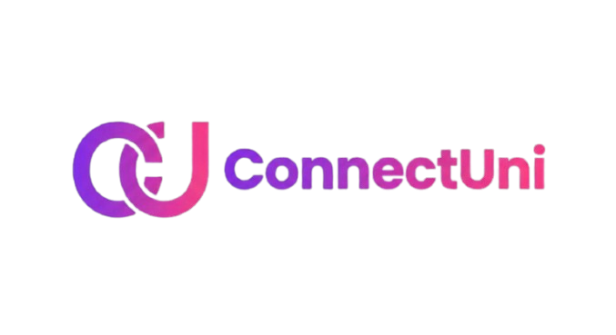

# 🎓 ConnectUni — University Social Network

<div align="center">
  

  <h3>Connect, Share, and Engage with Your Campus Community</h3>

  <p>
    <a href="https://connect-uni-omega.vercel.app">🌐 Live Demo</a> •
    <a href="https://connectuni-production.up.railway.app">⚙️ Backend API</a> •
    <a href="LICENSE">📄 MIT License</a>
  </p>
</div>

---

## 📖 About The Project

**ConnectUni** is a full-stack social media platform designed specifically for university students.  
It enables students to connect with classmates, share posts and stories, and communicate in real time using a modern MERN-based architecture.

---

## ✨ Key Features

- 🔐 JWT-based authentication
- 📸 Media sharing (images & videos)
- 📱 24-hour stories
- 💬 Real-time chat using Socket.IO
- 👤 Profile customization
- 🔍 User search & discovery
- ❤️ Like & engagement system

---

## 🚀 Live Demo

- **Frontend**: https://connect-uni-omega.vercel.app  
- **Backend**: https://connectuni-production.up.railway.app  

---

## 🛠️ Tech Stack

### Frontend
- React 19
- Vite
- Tailwind CSS
- React Router DOM
- Axios
- Socket.IO Client

### Backend
- Node.js
- Express
- MongoDB Atlas
- Mongoose
- JWT + Bcrypt
- Socket.IO
- Multer + Cloudinary

---

## 📁 Project Structure

```

UniConnect/
├── frontend/
├── backend/
└── README.md

````

---

## ⚙️ Local Setup

### Backend

```bash
cd backend
npm install
npm start
````

Create `.env`:

```env
MONGO_URI=your_mongodb_connection_string
JWT_SECRET=your_jwt_secret
CLOUDINARY_CLOUD_NAME=your_cloud_name
CLOUDINARY_API_KEY=your_api_key
CLOUDINARY_API_SECRET=your_api_secret
PORT=5000
```

---

### Frontend

```bash
cd frontend
npm install
npm run dev
```

Create `.env`:

```env
VITE_API_URL=http://localhost:5000
```

---

## 🌐 Deployment

* **Frontend**: Vercel
* **Backend**: Railway
* **Database**: MongoDB Atlas
* **Media Storage**: Cloudinary

---

## 👨‍💻 Author

**Ali Raza**

* GitHub: [https://github.com/AliRaza6666](https://github.com/AliRaza6666)
* LinkedIn: [https://www.linkedin.com/in/ali-raza-784b10362/](https://www.linkedin.com/in/ali-raza-784b10362/)

---

<div align="center">
  ⭐ Star this repository if you like the project  
  <br />
  Made with ❤️ by Ali Raza
</div>
```

---


